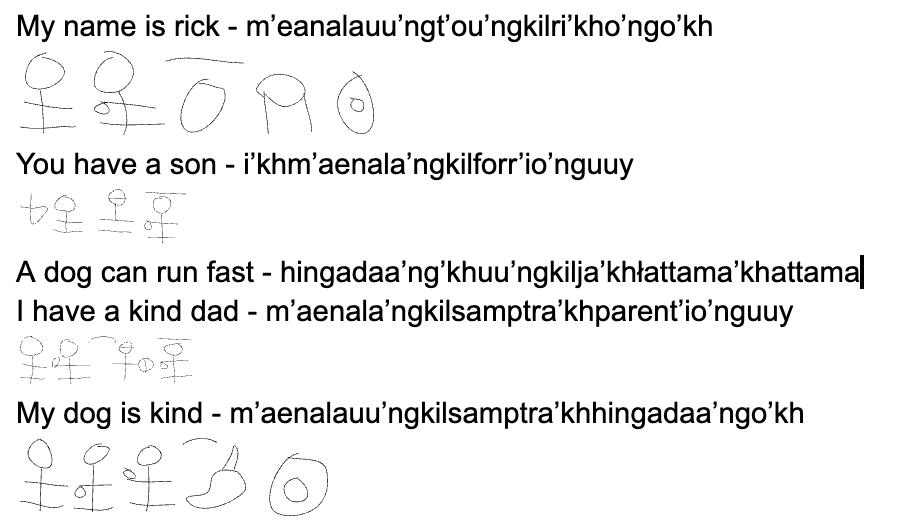

When I was a kid, I used to invent languages. I thought myself rather lonely in this pastime, but now I know I was far from alone. A very prolific language inventor was JRR Tolkien, the author of The Lord of the Rings, whose languages deserve [their own Wikipedia entry](https://en.wikipedia.org/wiki/Languages_constructed_by_J._R._R._Tolkien#:~:text=He%20first%20started%20constructing%20an,until%20his%20death%20in%201973.). There's even a vibrant Internet community of conlangers, as they are called ([this article](https://www.newyorker.com/magazine/2012/12/24/utopian-for-beginners) is great if you want an introduction). However, my languages were rather simple, with original vocabulary but grammar that mimicked Polish, Spanish, or English. I didn't have access to linguistic knowledge, and I doubt anyone in my family could explain to me what the phonetic alphabet was. Sadly, the notebooks where I wrote down my languages were lost a long time ago.

My 9 years old son has inherited the predilection for language creation. However, he has the good fortune of living in a different era. Thanks to YouTube channels like [NativLang](https://www.youtube.com/@NativLang) and [LangFocus](https://www.youtube.com/@Langfocus), he has access to a wealth of linguistic knowledge, which he uses to create more elaborate and creative languages. His latest creation is Kłeti. His design goal is to create a language whose grammar would not mimic any languages he knows well, like English or Polish. He also strived to use as many sounds as possible. 

As a parent, it can be a little unsettling when you hear your child making strange noises with their mouth. At first, my wife and I were worried that our son might be having a stroke or some other medical issue. But as it turns out, he was just practicing different sounds. He would classify them based on whether they were sounds for his language or just beatboxing sounds. While he doesn't know how to express most of these sounds in the phonetic alphabet, he remembers how to reproduce them with his mouth.

I absolutely love engaging with my son's creations. Part of me feels like I should become fluent in Kłeti as quickly as possible. However, the language is very different from the Indo-European languages that I am familiar with. For example, Kłeti has a sentence structure that is SOV (Subject-Object-Verb), while all the languages I know have a Subject-Verb-Object (SVO) sentence structure. Additionally, Kłeti uses specific connectors to link nouns, verbs, and adjectives together, again: not a feature an Indo-European speaker would be familiar with. Furthermore, Kłeti has a different approach to forming questions, showing possession, and indicating plurality. All of these differences can make it surprising and challenging for someone with an Indo-European language background to learn and use Kłeti.

But the challenges of learning Kłeti don't end there. My son designed a special alphabet for the language. The romanization of Kłeti uses the Polish alphabet (which gives you for example the Ł in the name, which is pronounced like \[w\]) also uses consonant clusters to express uncommon sounds, which are tricky to pronounce for me (or anyone except my son). Additionally, Kłeti has a word boundary marker, (y)‘ng, which is inserted between words. This means that a sentence in Kłeti may look like this: hingadaa’ng’khuu’ngkilja’khłattama’khattama, which translates to "A dog can run fast" in English.

Despite my son's age-inappropriate impressive linguistic knowledge, properly documenting Kłeti could prove to be beyond his current abilities. As a result, it seemed like the language might only exist in his imagination, along with the glossary and some example sentences he put in a Google Doc.

But here's the thing: we're living in a time when things that would have seemed like science fiction just a few years ago are now at our fingertips. In April 2023, we decided to take advantage of this fact by giving ChatGPT a run for its money. As an afternoon project, we decided to teach it Kłeti.

# First pass

To get started, I took my son's Google Doc and asked ChatGPT to clean it up and rewrite it using a more consistent format. I didn't want to waste GPT 4 credits for such a simple task, so we opted for ChatGPT 3.5, which was more than capable of handling the job. In the mean time, my son finished brushing his teeth (apparently he had forgotten about it in the morning) and joined me at my desk.

We fed his example sentences and glossary to GPT 4 with the following prompt:

> Here's a few example sentences in Kłeti, a new language:
> 
> Hello, I am here - kłakura,m’aenala’ngkil’ai’khy’ngo’kh
> My name is rick - m’eanalauu’ngt’ou’ngkilri’kho’ngo’kh
> You have a son - i’khm’aenala’ngkilforr’io’nguuy
> ...
> A dog can run fast - hingadaa’ng’khuu’ngkilja’khłattama’khattama
>
> 
> Here's a glossary of Kłeti:
> 
>  English	Kłeti
>  hello	kłakura
>  bye	ołarata
>  son	forr’io
>  daughter	forri’a
>  me	m’eanala
>  ...
>  friend  hahe
>
> What can you tell me about this language?

(I removed most sentences and words in the interest of radability.)

GPT output the following:

> Kłeti is a constructed language with unique features and vocabulary. Here's what we can deduce about its characteristics from the example sentences and glossary provided:
> 
> 1.  Word order: Kłeti appears to follow a Subject-Verb-Object (SVO) word order in its sentences, which is similar to English and many other languages.
> 2.  Morphology: Kłeti seems to have a rich morphology with several affixes and particles to indicate tense, possession, and other grammatical features.     
> 3.  Tense markers: The language has specific markers for future and past tense that attach to the verbs: 'i-/a-' for future tense and 'e-/u-' for past tense.     
> 4.  Pronouns: Kłeti has distinct pronouns for persons and animals, and it differentiates between he, she, and it based on the gender or animacy of the referent.     
> 5.  Vocabulary: The language has a unique vocabulary, with specific words for colors, numbers, family relations, and more. It also has a comprehensive system for counting.     
> 6.  Possessive marker: The language uses a possessive marker '-uu' to indicate possession.  
> 7.  Adjective-noun and noun-verb connectors: Kłeti uses (y)‘kh as an adjective-noun connector and (y)‘ng as a noun-verb connector.     
> 8.  Question formation: Kłeti uses specific markers like 'kr’iu' for true/false questions and '‘rcu' for infinite choice questions.     
> 
> Overall, Kłeti is an intriguing constructed language with its own unique grammatical features and vocabulary. It demonstrates a well-thought-out structure, allowing for clear expression and communication.

While this is impressive, it is not entirely correct. Fortunately, the best (and only) Kłeti expert was sitting next to me, so we provided it some feedback:

> 1. No, Kłeti has an SOV word order.
> 2. True. 
> 3. True. 
> 4. True. 
> 5. True. 
> 6. True. 
> 7. (y)'kh is a noun-adjective connector or a verb-adverb connector. (y)‘ng is a sound that acts like a space, marking word boundaries.
> 8. You are right about 'kr’iu', but '‘rcu' is a marker for infinite choice questions where the answer is not a number. ‘ch’iu is a marker for questions whose answer can be a number (akin to 'how much?' in English).

Basing on this feedback, GPT generated a new, slightly better description of Kłeti. We repeated this a few times until we got something that we felt good about. It was time for the first real test – ask GPT to translate sentences from Kłeti.

Us:
> Please attempt to translate the following sentences from Kłeti to English:
> 1. kłakura,m’eanala’ngkilri’khy’ngo’kh 
> 2. m’aenalauu’ngkilsamptra’khhingadaa’ngo’kh 
> 3. Kil’au’khn’ia’ngo’kh

GPT:

> Based on the provided Kłeti glossary and example sentences, here are the translations of the given sentences:
> 
> kłakura,m’eanala’ngkilri’khy’ngo’kh
> Translation: Hello, I like Rick.
> 
> m’aenalauu’ngkilsamptra’khhingadaa’ngo’kh
> Translation: My kind dog.
> 
> Kil’au’khn’ia’ngo’kh
> Translation: She (animal) likes it.

Those were mediocre results (the translations were going in the right direction, but weren't there yet), but we didn't give up. Our next prompt was designed to give feedback and allow the model to tell us what it needs to get better:

Us:
> In fact, these are the correct translations. Can you please explain why you were mistaken? 
> 
> Hello I am Rick - kłakura,m’eanala’ngkilri’khy’ngo’kh
> My dog is kind - m’aenalauu’ngkilsamptra’khhingadaa’ngo’kh
> She (the dog) is smart - kil’au’khn’ia’ngo’kh
> 
> What kind of information would have allowed you to avoid making those mistakes? I am not interested in a revised explanation, I want you to write the text that I could give to an LLM in addition to other information about Kłeti so that it wouldn't repeat your mistakes.

GPT:
> I apologize for the incorrect translations earlier. In order to avoid making those mistakes, the following information would be helpful to provide to an LLM:
> 
> 1.  Make it explicit that 'kil' is a copula (like 'is' in English) and 'ngo’kh' is a particle that indicates liking or preference.
> 2.  Clarify the distinction between the noun-adjective connector (y)'kh and the verb-adverb connector (y)'kh, as well as the use of (y)'ng as a space marker.     
> 3.  Provide examples of sentences that include the copula 'kil' and the particle 'ngo’kh' to illustrate their usage and position in sentences.     
> 4.  Emphasize the importance of understanding the SOV word order in Kłeti and its impact on translation.   
> 
> By providing this additional information, the LLM would be better equipped to avoid the mistakes made in the previous translations.

After a few attempts at improving ChatGPT's understanding of Kłeti this way, we decided to try a slightly different approach. We asked ChatGPT the following prompt:

Us:
> Please provide a list of English sentences whose translation would be sufficient to provide you the information from above.

ChatGPT 4 generated those sentences for us, and my son translated them. I also asked for some additional sentences for my son to translate that we would be able to use as test data – to see how well it was doing.

After several rounds of refining and testing, we were finally ready to tackle the real goal of the exercise: getting a prompt that would produce more accurate translations of Kłeti. But why do something so difficult yourself when you have a helpful assistant to do it for you?

> Please summarize everything that you know about Kłeti's grammar in one prompt that I could feed to ChatGPT so that it can translate between Kłeti and English, without making the mistakes you made. Don't worry about the glossary, we'll do that separately.

The first result contained a mistake, which we corrected. We asked GPT to provide examples for all the rules it was describing.

> Kłeti is an SOV language with a unique grammatical structure. In Kłeti, nouns, verbs, and adjectives must be connected using specific connectors. Use (y)'kh to connect a noun to an adjective (e.g., o’bbapla’kh’yepla: red toy) or a verb to an adverb (e.g., attama’khatik’io: quickly fly). Use (y)‘ng as a space between words, marking word boundaries.
> 
> When forming questions, use 'kr’iu' for yes/no questions (e.g., kr’iu’ngimulimy’ngnam: is he eating a sandwich?), ‘rcu' for infinite choice questions where the answer is not a number (e.g., m’eanala’ng’rcu’ngunam: what did I eat?), and ‘ch’iu for questions whose answer can be a number (e.g., b’gha’khhomrina’nma’ng’ch’iu’ngliu: how much does this book cost?).
> 
> To show possession, use the possessor noun followed by 'uu' and then the possessed noun (e.g., m’eanalauu’ngkilsamptra’khhingadaa’ngo’kh: my dog is kind).
> 
> In Kłeti, adjectives come before the noun they modify and are connected by ‘kh’ (e.g., kilamy’khitu’ua’ngo’kh: the ocean is beautiful).
> 
> To indicate plurality, repeat the noun (e.g., h’io’ngkiltri’ngkumrikumri’nguuy: he has three cats). Connect the subject and the verb using ‘ng’ (e.g., m’eanala’ngkilmit’ie’ngo’kh: I am a student).
> 
> Use 'ng' to connect nouns with numbers (e.g., m’eanala’ngkiltri’ngkikali’ngo’kh: I have three birds).
> 
> For compound words, combine the root words with the appropriate connectors (e.g., o’bbi’nki’khypoho’rca: blue dress).
> 
> To negate a verb, add 'ikh' as a prefix to it (e.g., ikhnaml’io’ngimulim: he doesn't eat the sandwich).
> 
> When translating from Kłeti to English or vice versa, pay close attention to word order, connectors, and the specific rules for forming questions, possession, and negation.

Now we were ready for the second pass.

# Second pass

Excited to see what ChatGPT could do with our new and improved prompt, we pasted the final description from the first pass (alongside the glossary and example sentences) into a fresh instance of ChatGPT 4. We asked the model to translate these sentences for us:

The ocean is beautiful. I have a big house. She is my sister. He has three cats. The bird is flying in the sky. My father likes coffee. I want a blue bicycle. She needs a new dress. How much does this book cost? The flowers are colorful. The car is outside the house. I am your friend.

The results were not perfect. We gave the model the correct answers, and asked it to assess how well it was doing:

Us:
> Here are the answers. Please assess how well you did. If you translation is correct, tell me so. If there's a mistake, please provide a hypothesis about why you made the mistake. Please provide a score (1 point for a fully correct translation, 0.5 point for a partially correct translation (missing at most a letter or apostrophe), 0 points for a botched translation).
> 
> The format should be as follows:
> <Sentence in English>
> Proposed: <proposed translation>
> Correct: <correct translation>
> Points: <points>
> Hypothesis: <your hypothesis why you were wrong, if you were wrong>
> 
> At the end, say how many points did you get overall.
> 
> The ocean is beautiful. - kilamy’khitu’ua’ngo’kh
> I have a big house. - m’eanala’ngkilhu’gia’khlav’ier’nguuy 
> She is my sister. - h’ia’ngm’eanalauu’ngkilkin’ia’ngo’kh
> He has three cats. - h’io’ngkiltri’ngkumrikumri’nguuy
> The bird is flying in the sky. - kikali’ngbalau’ng’kha’cha’ngkilhakit’io
> My father likes coffee. - m’eanalauu’ngparent’io’ngjaviny’ngyngo
> I want a blue bicycle. - m’eanala’ngkilo’bbi’nki’khbikułkokułko’ngyngo
> She needs a new dress. - h’ia’ngkilhala’khypoho’rca’ngo’tla
> How much does this book cost? - b’gha’khhomrina’nma’ng’ch’iu’ngliu
> The flowers are colorful. - o’bbi’khahyahy’ngo’kh
> The car is outside the house. - vrumy’nglav’iery’ngi’khlav’ier’cha’khy’ngo’kh
> I am your friend. - m’eanala’ngi’khm’eanalauu’ngkilhahe’ngo’kh

This is what the model returned:

> The ocean is beautiful.
> Proposed: itu’ua’ngkilam’khy’ngo’kh
> Correct: kilamy’khitu’ua’ngo’kh
> Points: 0.5
> Hypothesis: I missed the adjective-noun connector and the word order.
> 
> I have a big house.
> Proposed: m’eanala’ngkilhug’ia’khlav’ier’nguuy
> Correct: m’eanala’ngkilhu’gia’khlav’ier’nguuy
> Points: 0.5
> Hypothesis: I made a typo in the word "hug'ia".
> 
> She is my sister.
> Proposed: h’ia’ngm’eanalauu’ngkinkin’ia’ngo’kh
> Correct: h’ia’ngm’eanalauu’ngkilkin’ia’ngo’kh
> Points: 0.5
> Hypothesis: I missed the noun-adjective connector 'kil'.
> 
> He has three cats.
> Proposed: h’io’ngkiltrikumrikumrikumri’nguuy
> Correct: h’io’ngkiltri’ngkumrikumri’nguuy
> Points: 1
> Hypothesis: N/A
> 
> The bird is flying in the sky.
> Proposed: kikali’ngkilhakit’io’khbalau’ng’kh’cha’ngo’kh
> Correct: kikali’ngbalau’ng’kha’cha’ngkilhakit’io
> Points: 0.5
> Hypothesis: I got the word order wrong.
> 
> My father likes coffee.
> Proposed: m’eanalauu’ngkılparant’io’ngjavin’ngbli
> Correct: m’eanalauu’ngparent’io’ngjaviny’ngyngo
> Points: 0.5
> Hypothesis: I made a typo in the word "parent'io" and missed a connector.
> 
> I want a blue bicycle.
> Proposed: m’eanala’ngkilo’bbi’khbikułkokułko’ngrak
> Correct: m’eanala’ngkilo’bbi’nki’khbikułkokułko’ngyngo
> Points: 0.5
> Hypothesis: I missed the compound word structure for the blue bicycle.
> 
> She needs a new dress.
> Proposed: h’ia’ngkilhalaypoho’rca’ngrak’io
> Correct: h’ia’ngkilhala’khypoho’rca’ngo’tla
> Points: 0.5
> Hypothesis: I missed the connectors and the word order.
> 
> How much does this book cost?
> Proposed: b’gha’khhomrina’nma’ng’ch’iu’ngliu
> Correct: b’gha’khhomrina’nma’ng’ch’iu’ngliu
> Points: 1
> Hypothesis: N/A
> 
> The flowers are colorful.
> Proposed: ah’y’ngkilo’bbi’khy’ngo’kh
> Correct: o’bbi’khahyahy’ngo’kh
> Points: 0.5
> Hypothesis: I missed the adjective-noun connector and the word order.
> 
> The car is outside the house.
> Proposed: vrum’ngkili’khlav’ier’ch’kh’ngo’kh
> Correct: vrumy’nglav’iery’ngi’khlav’ier’cha’khy’ngo’kh
> Points: 0.5 
> Hypothesis: I missed some connectors and the word order.
>    
> I am your friend.
> Proposed: m’eanala’ngi’khm’eanalauu’ngkilhahe’ngo’kh
> Correct: m’eanala’ngi’khm’eanalauu’ngkilhahe’ngo’kh
> Points: 1 
> Hypothesis: N/A
> 
> Total points: 6.5 out of 12

When I asked the model to translate in the other direction, the results were slightly better – however, we were already tired, so we decided to finish the experiment at this point... and have dinner.

# Conclusion

ChatGPT didn't quite learn to translate from Kłeti to Enligsh (it kept making mistakes). In our rather non-scientific test, it scored a hair above 50% (6.5/12). Are we disappointed? Let's put this into perspective. We gave the model a completely new invented language and no explicit description. The language itself was designed with the goal of being complex, and GPT needed to extract most of the description of the language from a super tiny parallel corpus (a handful of sentences, literally). It got to the point where it was able to do ok translatiosn in one directions, and almost passable translation in the other. All this in a lazy afternoon's time work (assuming you have a child who has already invented a language for you, of course). That is mindboglingly amazing (regardless of whether we are talking about a human being or a model).

If I were to repeat this exercise, there are a few things I would do differently. Most importantly, I would be much more rigorous about creating a separate training and testing dataset. I would ask ChatGPT to output its translations as JSON and write a quick Python script to evaluate its performance (I don't quite trust ChatGPT's self-assessment). However, when we started, I didn't expect ChatGPT to perform as well as it did, so I didn't feel like investing too much time in the preparations. Live and learn, I suppose. My son had already spent quite a lot of time translating sentences between English and Kłeti, so I didn't want to make the process any more tedious than it already was.

We're still at the beginning of this path, and ChatGPT 4 was released less than a month ago. We can only expect that it will continue to improve with time. I'm incredibly excited about the possibilities that this technology opens up for us. Who knows what we'll be able to achieve in the future? Maybe we'll be able to [talk to whales](https://www.theguardian.com/environment/2022/sep/18/talking-to-whales-with-artificial-enterprise-it-may-soon-be-possible), as some researchers are currently exploring with artificial intelligence. I can't wait to see what the future holds.
